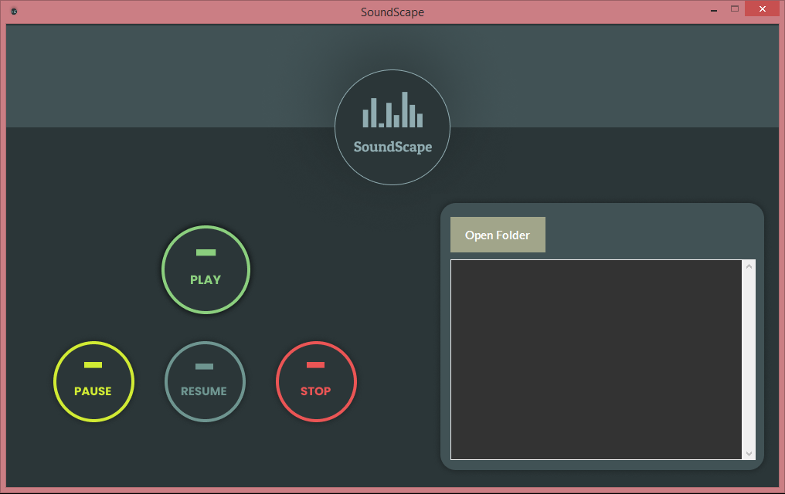
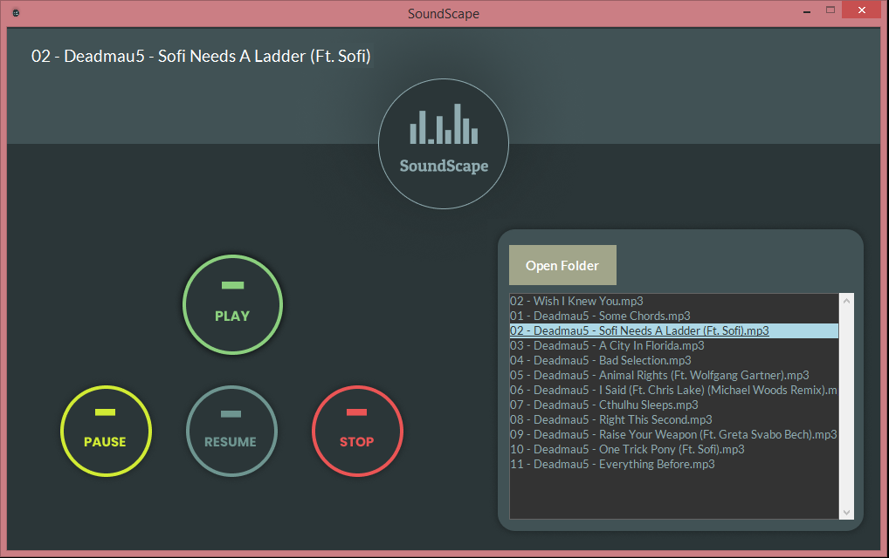

# SoundScape

SoundScape is an audio player built using Python and the tkinter, pygame module.

## Overview

### Screenshot

## My process

### Built with

- Python
- PyGame - pygame.mixer was used for handling the audio files and controlling them.
- tkinter - to make the graphical interface.

### Requirements

- You may have to install the <strong>pygame</strong> module in your system if you haven't already before running the program.
- Make sure all the files are in the same folder

### Author

- LinkedIn - [Sarad Sapkota](https://www.linkedin.com/in/sarad-sapkota/)
- Twitter - [@SapkotaSarad](https://twitter.com/SapkotaSarad)
